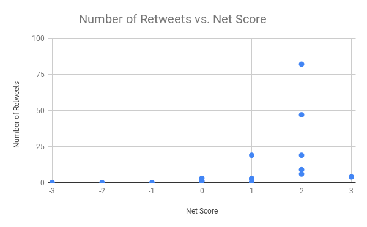

## Google provided course of Python in Coursera **Final_Project**

> <ins>**Question**</ins>: We have provided some synthetic (fake, semi-randomly generated) twitter data in a csv file named project_twitter_data.csv which has the text of a tweet, the number of retweets of that tweet, and the number of replies to that tweet. We have also words that express positive sentiment and negative sentiment, in the files positive_words.txt and negative_words.txt.
>
> Your task is to build a sentiment classifier, which will detect how positive or negative each tweet is. You will create a csv file, which contains columns for the Number of Retweets, Number of Replies, Positive Score (which is how many happy words are in the tweet), Negative Score (which is how many angry words are in the tweet), and the Net Score for each tweet. At the end, you upload the csv file to Excel or Google Sheets, and produce a graph of the Net Score vs Number of Retweets.

There is three file named `project_twitter_data.csv`, `positive_words.txt` and `negative_words.txt`. I need to read `project_twitter_data.csv` file and get texts of tweets, and then need to read `positive_words.txt` and `negative_words.txt` file too and match those words to the texts of tweets belongs to the `project_twitter_data.csv` file and count the positive and negative words. After all, make another `.csv` file where will be 5 columns **Number of Retweets**, **Number of Replies**, **Positive Score**, **Negative Score** and **Net Score**.

At last, these resulted data in `file/resulted_file.csv` have to open to google sheet or excel and make scatter chart as 'Number of Retweets Vs Net Score'.

